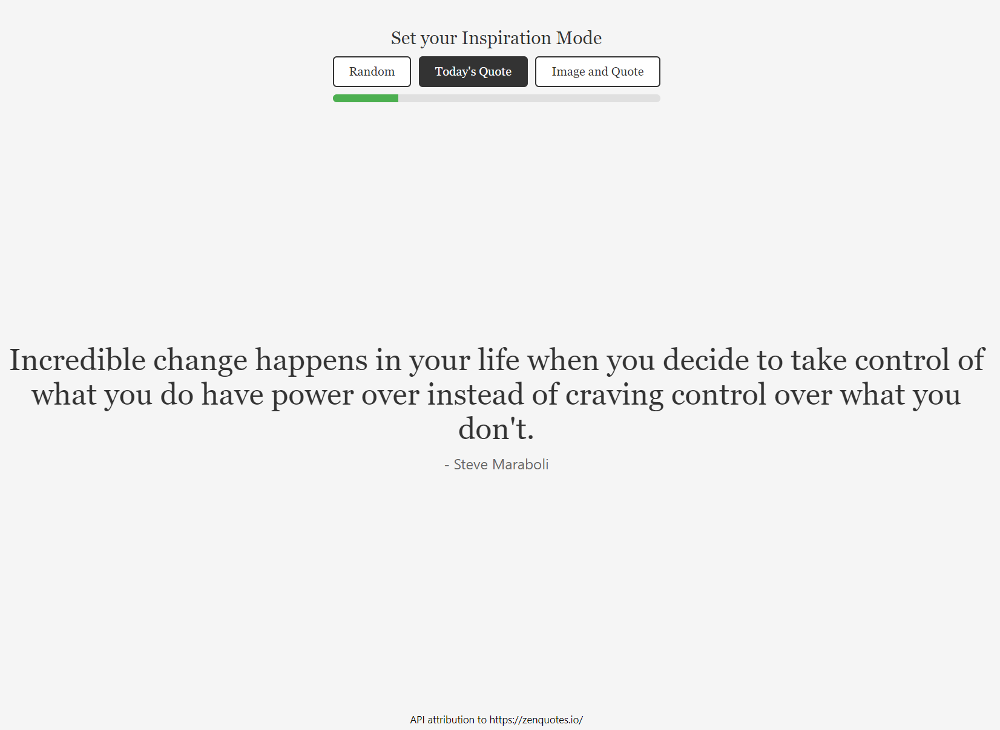

# Random Quote Generator App

## Description

This is a simple one-page React application that fetches and displays random quotes using REST API's with help of an express node server. 

Users can switch between different modes (Random, Today's Quote, and Image and Quote). The app also includes a visual indicator to track the number of API requests and informs the user when they need to wait before making additional requests.

Updates to come will include user profile handling with quote records with a RDMS system (eg. postgressql) to be deployed.

**Key Detail:** 
*To save on API limits, the app will utilize the **/quotes** endpoint to get 50 random quotes. Once the user has randomly viewed all 50, a new API request is done to gather a new block.* 

## Features

- **Display Random Quotes:** Fetch and display random quotes from an external API.
- **Different Modes:** Switch between different modes including:
  - Random Quotes
  - Today's Quote
  - Image and Quote
- **Visual Indicator:** A progress indicator shows how many requests have been made and when the user should wait before making more requests.
- **Image Integration:** Display images associated with quotes in one of the modes.

## Setup

### Prerequisites

Ensure you have Node.js and npm installed on your machine.

### Installation

1. **Clone the repository:**

   ```bash
   git clone https://github.com/your-username/your-repo.git

2. **install dependencies in randomquoteapp and server folder:**

   ```bash
   npm install

3. **Run apps:**

   ```bash
   randomquoteapp -> npm start -> http://localhost:3000
   server -> nodemon index -> http://localhost:5000

## Usage

1. Switch Modes: Click on the buttons to switch between the different modes (Random, Today's Quote, Image and Quote).
2. View Quotes: Quotes will appear in the center of the screen. If in "Image and Quote" mode, an image will be displayed along with the quote.
3. Request Limit: The progress bar will fill up with each request. Once 5 requests are made, you will need to wait 30 seconds before making more requests.

See demo for information.

## Demo




### API Attribution
The quotes are fetched from ZenQuotes. Attribution is provided in the app.js.


